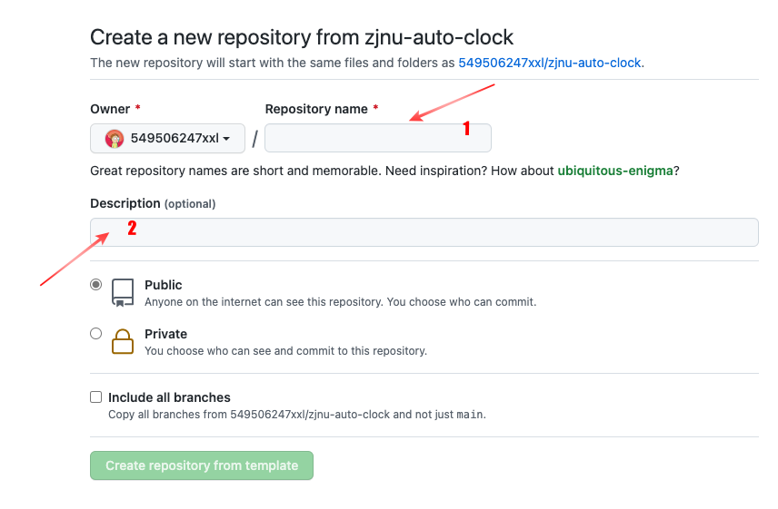
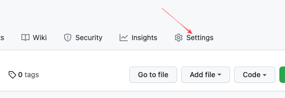
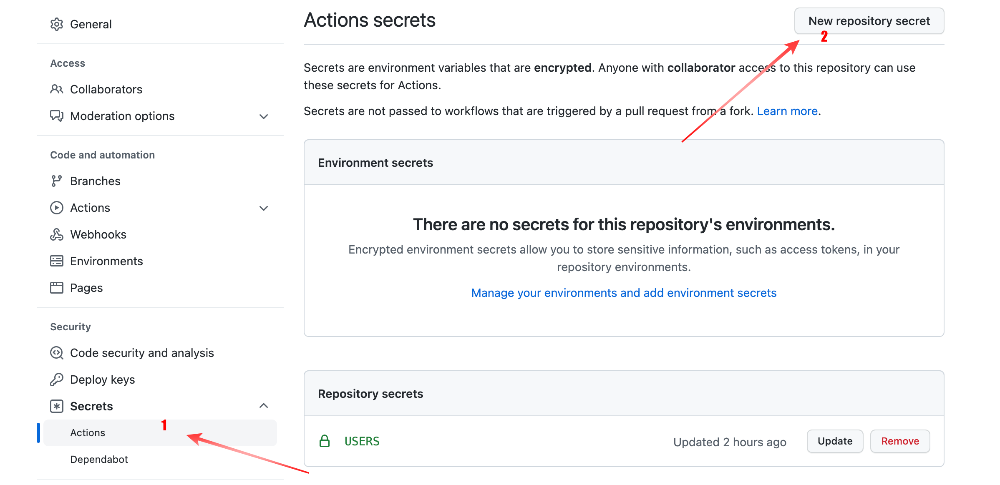
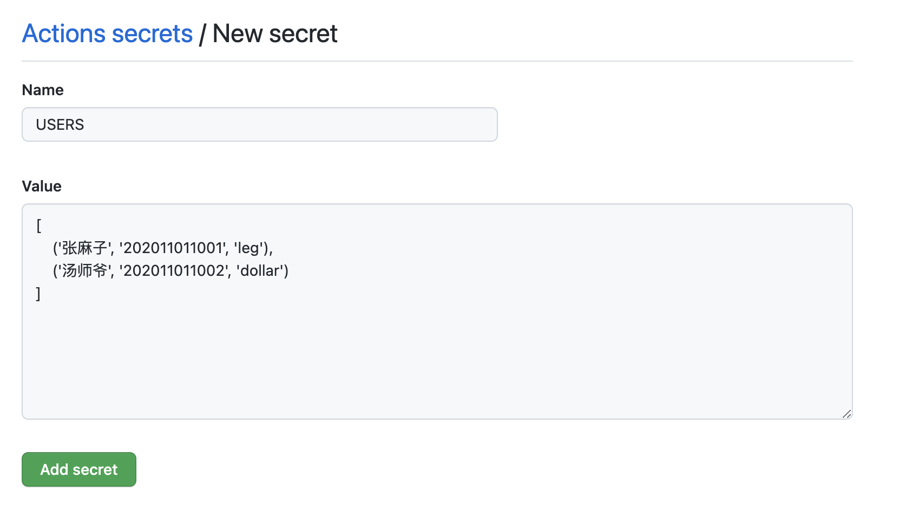
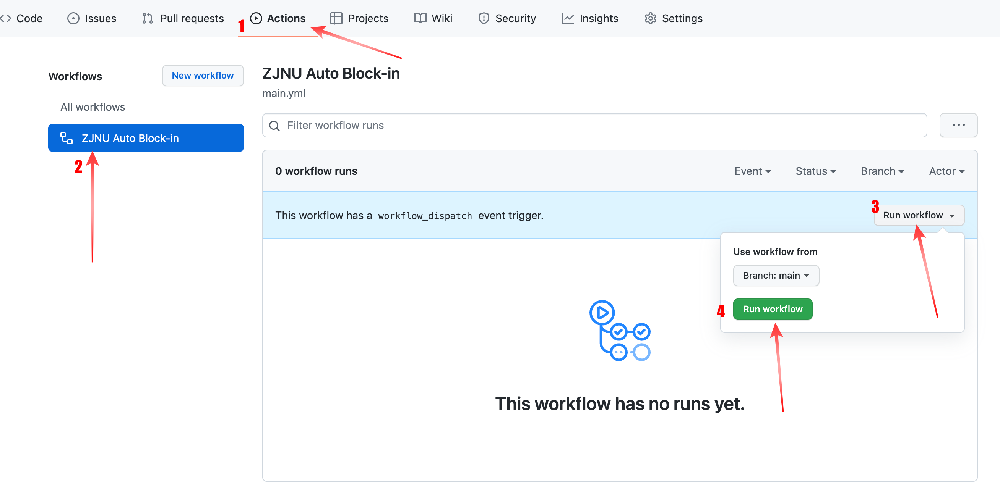
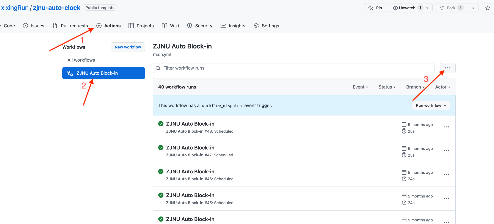

# 浙江师范大学-疫情打卡自动填报 Beta版本
## 更新日志

2022-09-18 

- 修复了已知问题，更新了隐藏字段，脚本已可以重新启用，下一步工作需要动态获取隐藏字段信息。
- 大家的需要同步所fork的仓库和主仓库一致，即可使用最新的版本，该操作可以在GitHub完成，点击**Code**下方的**Sync fork**即可。

---

2022-09-16 脚本暂时无法使用，请自行先disable程序运行，待维护好后再启用。

---

已可以重新启用，支持在家打卡，在学校打卡没有验证，在校生打卡遇到问题请和我联系...  
如果切换位置信息，比如从家里到学校，或者从学校到家里，请及时关闭该Actions，并修改信息再启用。

浙江师范大学 每日信息填报自动打卡脚本，一次设置，自动打卡，再也不怕班长催，导员赶。
免责声明：仅供学习技术交流，不作任何商业用途。

<!-- PROJECT SHIELDS -->

[![Contributors][contributors-shield]][contributors-url]
[![Forks][forks-shield]][forks-url]
[![Stargazers][stars-shield]][stars-url]
[![Issues][issues-shield]][issues-url]


## 目录

- [功能介绍](#功能介绍)
- [立即开始](#立即开始)
- [参数修改](#参数修改)
- [使用到到技术](#使用到的技术)
- [作者](#作者)

### 功能介绍
- 一次设置打卡参数，每天定时自动打卡
- 简单方便，可以多人打卡
- 支持必要的参数修改，在家or学校，更改一次即可

### 立即开始
你需要有：
- GitHub账户
- 注册登陆地址：https://github.com/

1、克隆该项目模版（下面方法二选一即可）
- fork: 点击右上角的fork，将项目拉去到自己的GitHub仓库 </br>
</img>
- Use this template: 点击Code右端的**Use this template**，填写Repository name、Description (可选) </br>
</img> </br>
</img></br>
2、创建密钥
进入刚刚创建的仓库，点击
**Settings** -> **Secrets** -> **New repository secret** </br>
</img></br>
</img></br>

3、添加密钥
添加学生的基本信息，包括姓名、学号和密码
第四个参数四个地址选一
- 如果在学校，填写完整的校区名称
  - 浙江师范大学本部校区
  - 浙江师范大学杭州校区
  - 浙江师范大学兰溪校区
- 如果在家里，则填写家里的地址: 例如 **河南省 焦作市 沁阳市** 

**Name:** 

```
USERS
```

**Value:**  

```python3
[
    ('汤师爷', '202011011002', 'dollar', '浙江师范大学本部校区'),
    ('张麻子', '202011011001', 'gege', '河南省 焦作市 沁阳市'),
]
```
</img></br>

4、启动程序
手动点击**Actions**，运行workflow，等待运行...  
</img>  

运行成功...  
如果运行失败可以去查看一下错误信息，联系作者...

### 参数修改(默认不需要修改)
1、修改打卡时间
在 .github/workflows/main.yml 中来设置每天运行的时间：
```bash
  on:
    schedule:
      - cron: "1 16 * * *"
```
上述代码表示程序的定时执行，时区是UTC: 分 时 日 月 日 </br>
默认情况下，该脚本定时每天00:01执行，你可以根据自己的需要更改该设置</br>
GitHub的actions提供的服务器定时系统有一定的误差和延迟，但是不影响使用</br>

### 关闭自动打卡Actions
</img></br>
如上图所示，在第3步的...点击"Disable workflow"即可关闭该工作流。
在更换好在校信息或未返校信息后，再次启用即可。

### 使用到的技术

- [python3](https://www.python.org/)
- [python第三方处理http包：requests](https://pypi.org/project/requests/)
- [beautifulSoup4](https://pypi.org/project/beautifulsoup4/)
- [Github-Actions](https://docs.github.com/en/actions/learn-github-actions)


### 作者

email: xlxing@bupt.edu.cn

<!-- links -->

[contributors-shield]: https://img.shields.io/github/contributors/xlxingRun/zjnu-auto-clock.svg?style=flat-square
[contributors-url]: https://github.com/xlxingRun/zjnu-auto-clock/graphs/contributors
[forks-shield]: https://img.shields.io/github/forks/xlxingRun/zjnu-auto-clock.svg?style=flat-square
[forks-url]: https://github.com/xlxingRun/zjnu-auto-clock/network/members
[stars-shield]: https://img.shields.io/github/stars/xlxingRun/zjnu-auto-clock.svg?style=flat-square
[stars-url]: https://github.com/xlxingRun/zjnu-auto-clock/stargazers
[issues-shield]: https://img.shields.io/github/issues/xlxingRun/zjnu-auto-clock.svg?style=flat-square
[issues-url]: https://github.com/xlxingRun/zjnu-auto-clock/issues
